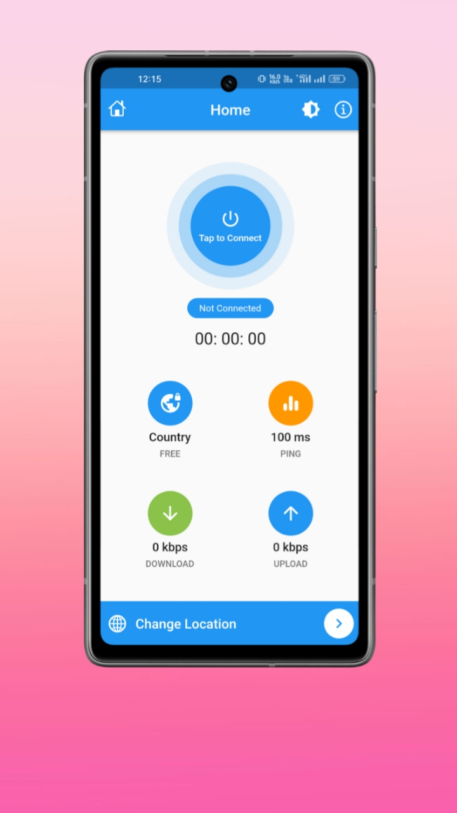

# ElephantVPN: Fast & Reliable VPN for Privacy and Online Security


## Screenshot
<kbd>




</kbd>
<br>
<br>
  
## Features👇
<ul>
<li>Many Free Public Servers (From: https://www.vpngate.net/en/)
<li>Secure OpenVPN Protocol
<li>No Signing Required
<li>IP Address Test
<li>Data Caching
<li>Google Test Ads Integrated
<li>Decent UI with New Material Widgets
</ul>

## Commands to build signed apk
```
flutter build apk --release --no-tree-shake-icons
flutter build appbundle --release --no-tree-shake-icons
```


For feedback contact: prasoonk187@gmail.com
